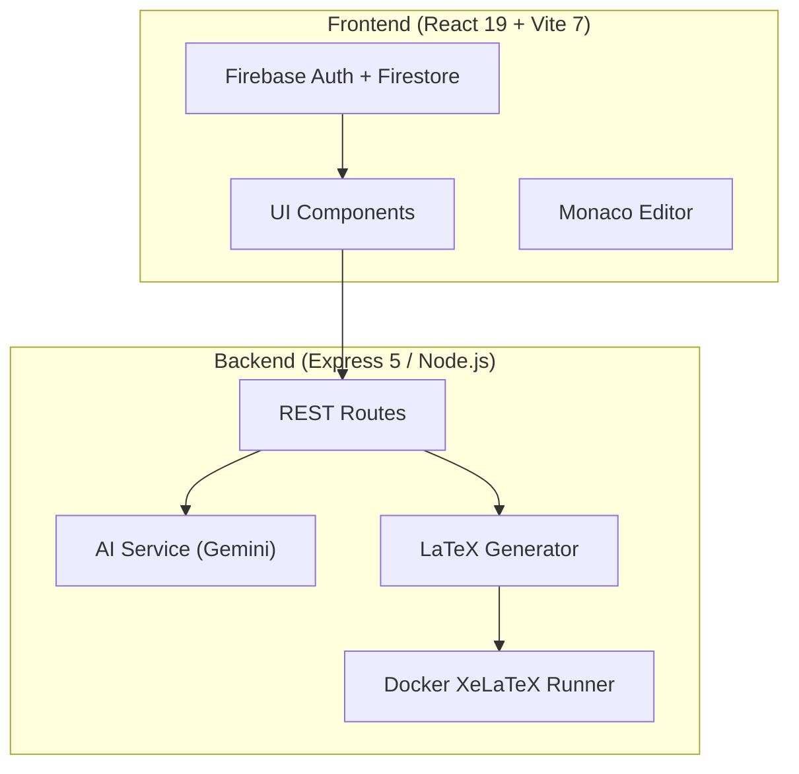
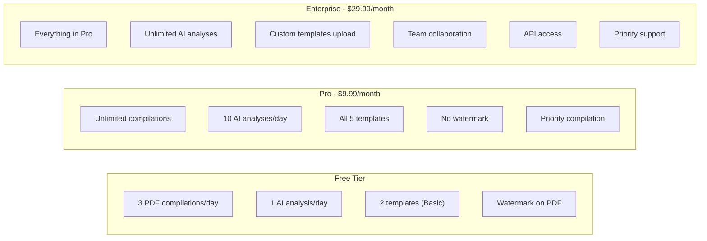
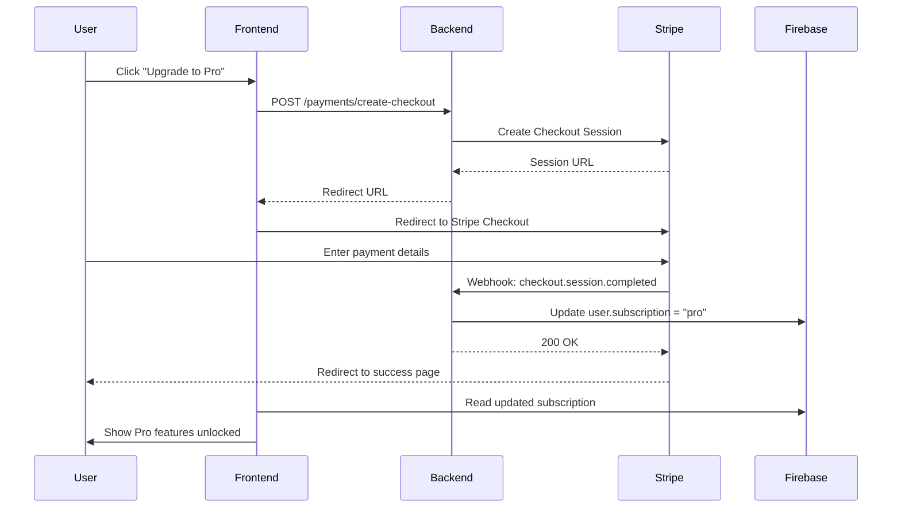
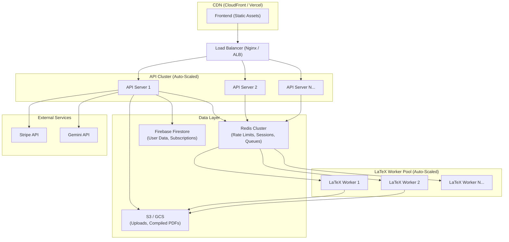
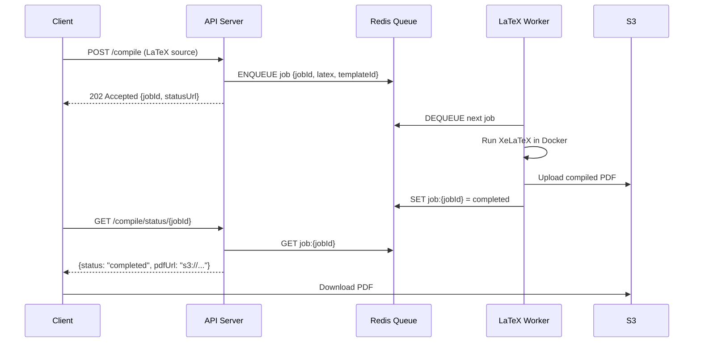

# ResumeGenie.AI — Monetization, Rate Limiting, Horizontal Scaling & Architectural Hardening Plan

> [!IMPORTANT]
> This document is a comprehensive engineering & business plan covering four pillars:
> 1. **Payment Gateway Integration** (Monetization)
> 2. **API Rate Limiting & IP Tracking**
> 3. **Horizontal Scaling Strategy**
> 4. **Architectural Problems & Solutions** (User + System perspective)

---

## Table of Contents

1. [Current Architecture Snapshot](#1-current-architecture-snapshot)
2. [Monetization — Payment Gateway Integration](#2-monetization--payment-gateway-integration)
3. [API Rate Limiting & IP Tracking](#3-api-rate-limiting--ip-tracking)
4. [Horizontal Scaling Strategy](#4-horizontal-scaling-strategy)
5. [Architectural Problems & Solutions](#5-architectural-problems--solutions)
6. [Implementation Phases & Roadmap](#6-implementation-phases--roadmap)
7. [Tech Stack Additions Summary](#7-tech-stack-additions-summary)

---

## 1. Current Architecture Snapshot



### Current Endpoints

| Route | Method | Purpose | Cost Center |
|-------|--------|---------|-------------|
| `/compile` | POST | LaTeX → PDF compilation (Docker) | 🔴 High (CPU + Docker) |
| `/template` | GET/POST | Template selection & LaTeX generation | 🟢 Low |
| `/resume/generate-latex` | POST | Structured data → LaTeX | 🟢 Low |
| `/resume/validate` | POST | Validate resume schema | 🟢 Low |
| `/ai/analyze` | POST | AI resume analysis (Gemini API) | 🔴 High (API cost) |
| `/upload` | POST | PDF upload (multer) | 🟡 Medium (disk I/O) |
| `/upload/extract` | GET | PDF text extraction | 🟡 Medium (CPU) |

### Key Observations

- **No authentication middleware** on any backend route — all endpoints are fully public
- **No rate limiting** — any IP can call any endpoint unlimited times
- **Single-process Node.js** — no clustering, no load balancing
- **Synchronous Docker calls** using `execSync` — blocks the event loop
- **Local filesystem** for temp files (`tmp/`, `uploads/`) — not scalable across instances
- **No payment or subscription layer** — all features are free
- **Firebase Auth exists on frontend only** — backend doesn't verify tokens

---

## 2. Monetization — Payment Gateway Integration

### 2.1 Pricing Model (Freemium + Pay-Per-Use)



| Feature | Free | Pro ($9.99/mo) | Enterprise ($29.99/mo) |
|---------|------|----------------|------------------------|
| PDF Compilations | 3/day | Unlimited | Unlimited |
| AI Resume Analysis | 1/day | 10/day | Unlimited |
| Templates | 2 (Basic) | All 5 | All + Custom upload |
| PDF Watermark | Yes | No | No |
| Priority Queue | No | Yes | Yes |
| Resume Versions | 1 | 5 | Unlimited |
| JD Matching | No | Yes | Yes |
| API Access | No | No | Yes |
| Support | Community | Email | Priority + Chat |

### 2.2 Payment Gateway — Stripe Integration

> [!TIP]
> **Why Stripe?** Best-in-class developer experience, handles SCA/PSD2 compliance automatically, supports 135+ currencies, has excellent webhook reliability, and the Checkout Session flow means you never touch raw card data.

#### Architecture



#### Backend Implementation Plan

**New files to create:**

| File | Purpose |
|------|---------|
| `backend/routes/payments.js` | Stripe checkout, portal, webhook routes |
| `backend/services/subscriptionService.js` | Subscription CRUD, tier checking |
| `backend/middleware/authMiddleware.js` | Firebase token verification |
| `backend/middleware/tierMiddleware.js` | Feature-gating based on subscription tier |

**Key routes:**

```text
POST   /payments/create-checkout     → Create Stripe Checkout Session
POST   /payments/webhook             → Stripe webhook handler (raw body!)
POST   /payments/create-portal       → Stripe Customer Portal (manage subscription)
GET    /payments/status              → Get current user's subscription status
```

**Critical implementation details:**

1. **Webhook signature verification** — Always verify `stripe-signature` header using `stripe.webhooks.constructEvent()`. Never trust unverified webhook payloads.

2. **Raw body for webhooks** — The `/payments/webhook` route MUST receive the raw request body (not JSON-parsed). This means adding `express.raw({ type: 'application/json' })` specifically for this route BEFORE the global `express.json()` middleware.

3. **Idempotency** — Handle duplicate webhook deliveries gracefully. Store processed event IDs and skip duplicates.

4. **Firestore schema for subscriptions:**

```json
{
  "users/{uid}": {
    "email": "user@example.com",
    "displayName": "John Doe",
    "subscription": {
      "tier": "pro",
      "stripeCustomerId": "cus_xxx",
      "stripeSubscriptionId": "sub_xxx",
      "status": "active",
      "currentPeriodEnd": "2026-04-18T00:00:00Z",
      "cancelAtPeriodEnd": false
    },
    "usage": {
      "compilationsToday": 2,
      "aiAnalysesToday": 0,
      "lastResetDate": "2026-03-18"
    }
  }
}
```

5. **Environment variables to add:**

```env
STRIPE_SECRET_KEY=sk_test_xxx
STRIPE_PUBLISHABLE_KEY=pk_test_xxx
STRIPE_WEBHOOK_SECRET=whsec_xxx
STRIPE_PRO_PRICE_ID=price_xxx
STRIPE_ENTERPRISE_PRICE_ID=price_xxx
```

### 2.3 One-Time Purchase Option (Pay-Per-Use Credits)

For users who don't want subscriptions:

| Credit Pack | Price | Compilations | AI Analyses |
|-------------|-------|-------------|-------------|
| Starter | $2.99 | 10 | 3 |
| Standard | $7.99 | 30 | 10 |
| Power | $14.99 | 75 | 25 |

This can be implemented using Stripe's **Payment Intents** for one-time charges and tracking credits in Firestore.

---

## 3. API Rate Limiting & IP Tracking

### 3.1 Rate Limiting Strategy

> [!WARNING]
> Without rate limiting, your server is vulnerable to:
> - **DDoS attacks** — Malicious flooding of expensive endpoints
> - **API abuse** — Bots scraping/spamming your AI analysis
> - **Cost explosion** — Unbounded Gemini API calls = unbounded bills
> - **Resource exhaustion** — Docker containers consuming all CPU/memory

#### Implementation: `express-rate-limit` + `rate-limit-redis`

**Tier-based rate limits:**

```text
┌─────────────────────────────────────────────────────────────────┐
│                     Rate Limiting Tiers                          │
├──────────────┬──────────┬───────────┬───────────────────────────┤
│ Endpoint     │ Free     │ Pro       │ Enterprise                │
├──────────────┼──────────┼───────────┼───────────────────────────┤
│ /compile     │ 3/day    │ 60/hour   │ 200/hour                  │
│ /ai/analyze  │ 1/day    │ 10/day    │ 100/day                   │
│ /upload      │ 5/day    │ 30/day    │ 100/day                   │
│ /template    │ 30/hour  │ 120/hour  │ 500/hour                  │
│ /resume/*    │ 20/hour  │ 100/hour  │ 500/hour                  │
│ Global       │ 100/15m  │ 500/15m   │ 2000/15m                  │
└──────────────┴──────────┴───────────┴───────────────────────────┘
```

**New files:**

| File | Purpose |
|------|---------|
| `backend/middleware/rateLimiter.js` | Rate limiting middleware factory |
| `backend/middleware/ipTracker.js` | IP logging, abuse detection, and geo-tracking |

#### Rate Limiter Middleware Design

```text
Request arrives
  → Extract IP (req.ip / X-Forwarded-For if behind proxy)
  → Identify user (Firebase token → uid, or fallback to IP)
  → Check user tier (free / pro / enterprise)
  → Apply tier-specific rate limit for the endpoint
  → If within limit → proceed to route handler
  → If exceeded → return 429 Too Many Requests + Retry-After header
```

#### IP Tracking & Abuse Detection

Track the following per IP:

```json
{
  "ip": "203.0.113.42",
  "requests": {
    "total": 1523,
    "by_endpoint": {
      "/compile": 45,
      "/ai/analyze": 12
    }
  },
  "first_seen": "2026-03-01T10:00:00Z",
  "last_seen": "2026-03-18T23:30:00Z",
  "geo": {
    "country": "IN",
    "city": "Mumbai"
  },
  "flags": {
    "is_suspicious": false,
    "failed_auth_attempts": 0,
    "rate_limit_hits": 3
  }
}
```

**Abuse detection rules:**

1. **Velocity check** — More than 10 compile requests in 1 minute → temporary block
2. **Failed auth spike** — More than 5 failed auth attempts in 5 minutes → 15-minute cooldown
3. **Payload size anomaly** — LaTeX payloads > 500KB → flag and throttle
4. **Geographic anomaly** — Same user, requests from 3+ countries in 1 hour → flag
5. **Bot pattern detection** — No variation in request timing (perfectly uniform intervals) → CAPTCHA challenge

### 3.2 Storage Backend for Rate Limiting

| Environment | Store | Why |
|-------------|-------|-----|
| Development | In-memory (Map) | Simple, no setup |
| Production (single server) | Redis (single instance) | Fast, persistent across restarts |
| Production (multi-server) | Redis Cluster | Shared state across all backend instances |

> [!NOTE]
> In-memory rate limiting **will not work** when you scale horizontally. Two servers with in-memory stores each see half the requests, effectively doubling the user's rate limit. Redis is mandatory for production.

---

## 4. Horizontal Scaling Strategy

### 4.1 Current Bottlenecks Preventing Horizontal Scaling

| Bottleneck | Why It Breaks | Fix |
|------------|---------------|-----|
| `execSync` in Docker runner | Blocks Node.js event loop completely | Switch to `execFile` (async) |
| Local filesystem (`tmp/`, `uploads/`) | Files on Server A aren't on Server B | Use S3/GCS for uploads, shared volume or object storage for temp |
| In-memory state (none currently, but no Redis) | Sessions/rate-limits not shared | Add Redis |
| Single `app.listen()` | Single process, single core | Use PM2 cluster mode or Kubernetes |
| Hardcoded `localhost:5000` | Can't route to multiple backends | Put behind a load balancer (Nginx / ALB) |
| Docker-in-Docker for LaTeX | Each backend instance needs Docker | Dedicated LaTeX compilation worker pool |

### 4.2 Target Architecture for Horizontal Scaling



### 4.3 Key Scaling Changes

#### A. Decouple LaTeX Compilation into a Job Queue

This is the **single most critical change** for horizontal scaling.



**Why this matters:**
- API servers stay lightweight and responsive (no Docker calls)
- Workers can be scaled independently based on compilation load
- A crashed worker doesn't take down the API
- You can prioritize Pro/Enterprise jobs in the queue

**Technology choice:** Use **BullMQ** (Redis-based job queue for Node.js)
- Supports priority queues (Pro users get priority)
- Built-in retry, backoff, and dead-letter queues
- Dashboard for monitoring (Bull Board)

#### B. Object Storage for Files

| Current (Local FS) | Target (Cloud Storage) |
|---------------------|----------------------|
| `backend/tmp/{jobId}/` for LaTeX compilation | S3/GCS bucket: `resumegenie-compilations/{jobId}/` |
| `backend/uploads/` for PDF uploads | S3/GCS bucket: `resumegenie-uploads/{userId}/` |
| Compiled PDFs on local disk | S3/GCS bucket: `resumegenie-pdfs/{userId}/{jobId}.pdf` |

Use **pre-signed URLs** for downloads — never stream large files through your API servers.

#### C. Containerization with Docker Compose / Kubernetes

**Docker Compose (staging/small production):**

```text
services:
  api:
    replicas: 3
    image: resumegenie-api
    depends_on: [redis]
    
  latex-worker:
    replicas: 5
    image: resumegenie-worker
    depends_on: [redis]
    volumes:
      - /var/run/docker.sock:/var/run/docker.sock  # Docker-in-Docker
    
  redis:
    image: redis:7-alpine
    
  nginx:
    image: nginx:alpine
    ports: ["80:80", "443:443"]
```

**Kubernetes (large-scale production):**

- API servers as a **Deployment** with HPA (Horizontal Pod Autoscaler)
- LaTeX workers as a **Deployment** with HPA based on queue depth
- Redis as a **StatefulSet** or managed service (ElastiCache / Memorystore)
- Ingress controller (Nginx Ingress) for routing + TLS

#### D. Database Considerations

Firebase Firestore **scales automatically** — this is actually one of the strongest parts of the current architecture. However:

- **Add server-side caching with Redis** for frequently accessed data (user subscription tier) to avoid Firestore read costs
- **Implement Firestore Security Rules** properly since backend now needs admin access

### 4.4 Auto-Scaling Policies

| Component | Scale Trigger | Min | Max |
|-----------|---------------|-----|-----|
| API Servers | CPU > 70% or Request latency > 500ms | 2 | 10 |
| LaTeX Workers | Queue depth > 10 or Worker CPU > 80% | 2 | 20 |
| Redis | Memory > 75% | 1 | 3 (cluster) |

---

## 5. Architectural Problems & Solutions

### 5.1 User-Perspective Problems

#### 🔴 P1: No User Authentication on Backend

**Problem:** Backend has zero auth middleware. Any anonymous user can call `/ai/analyze` or `/compile` unlimited times. Firebase Auth only exists on the frontend — the backend never verifies tokens.

**Impact:** 
- Cannot enforce per-user limits
- Cannot implement paid tiers
- Anyone can use your Gemini API key for free

**Solution:**

```text
Request → Extract Bearer Token → Verify with Firebase Admin SDK
  → Attach user context (uid, email, tier) to req.user
  → Proceed to route handler
```

Create `backend/middleware/authMiddleware.js`:
- Use `firebase-admin` SDK to verify ID tokens
- Attach decoded token to `req.user`
- For **public routes** (like webhook), skip auth
- For **optional auth routes** (templates), allow anonymous but attach user if token present

---

#### 🔴 P2: PDF Compilation is Synchronous & Blocking

**Problem:** `execSync` in [dockerRunner.js](file:///d:/latex-editor/backend/utils/dockerRunner.js#L32) blocks the entire Node.js event loop during LaTeX compilation. If compilation takes 10 seconds, ALL other requests (AI analysis, template fetching, uploads) are frozen for that duration.

**Impact:**
- 5 concurrent compile requests = 50 seconds of total blocking
- Users see timeouts on unrelated features
- Server essentially becomes single-threaded per compile

**Solution:**
- **Immediate fix:** Replace `execSync` with `child_process.execFile` (async/promise-based)
- **Long-term fix:** Move compilation to a dedicated worker pool (see [Section 4.3A](#a-decouple-latex-compilation-into-a-job-queue))

---

#### 🟡 P3: No Compilation Progress Feedback

**Problem:** Users click "Compile" and see nothing until the PDF arrives or an error occurs. Compilation can take 5-15 seconds.

**Impact:** Users spam the compile button → multiple Docker containers → server overload

**Solution:**
- Add a **loading state with progress indicators** on the frontend
- Implement **Server-Sent Events (SSE)** or **WebSocket** for real-time compilation status:
  ```text
  → Queued → Compiling → Post-processing → Complete
  ```
- Add a **debounce/cooldown** on the compile button (minimum 5 seconds between clicks)

---

#### 🟡 P4: No Offline / Degraded Experience

**Problem:** If Docker is down, the backend crashes entirely on compile requests. If Gemini API is down, AI analysis fails completely. No graceful degradation.

**Impact:** Users lose all functionality if any single dependency fails

**Solution:**
- **Circuit breaker pattern** on external calls (Docker, Gemini API, Stripe)
- **Fallback for AI:** Return cached/deterministic scoring (which already exists!) when Gemini is unavailable
- **Fallback for compilation:** Queue the job and email the user when it's done
- **Health check endpoint:** `GET /health` that reports status of all dependencies

---

#### 🟡 P5: Uploaded PDFs Not Cleaned Up

**Problem:** Files in `backend/uploads/` are never deleted. The cleanup code in `compile.js` is commented out.

**Impact:** Disk fills up over time → server crashes

**Solution:**
- Move to **object storage (S3/GCS)** with lifecycle policies (auto-delete after 24 hours)
- For local: Implement a cron job or on-startup cleanup for files older than 24 hours
- Set a max total storage limit per user

---

#### 🟢 P6: No Email Notifications

**Problem:** Users have no way to receive compilation results, subscription confirmations, or usage alerts.

**Solution:** Integrate **SendGrid** or **AWS SES** for transactional emails:
- Subscription confirmation
- Payment receipt
- Usage limit warnings (e.g., "You've used 2 of 3 free compilations today")
- Compilation complete (for queued jobs)

---

### 5.2 System-Perspective Problems

#### 🔴 S1: Docker-in-Docker Security Risk

**Problem:** The Docker runner spawns containers from within the API server process. If the API server is compromised, the attacker has access to the Docker socket.

**Impact:** Container escape → host system compromise

**Solution:**
- **Never mount Docker socket in production** — use a dedicated compilation service
- Run LaTeX workers in **rootless Docker** or **gVisor** sandboxed containers
- Apply **resource limits** on LaTeX containers:
  ```text
  --memory=512m --cpus=1 --network=none --read-only
  ```
- Add `--network=none` to prevent compiled LaTeX from making outbound network calls (LaTeX can execute arbitrary code via `\write18`)

---

#### 🔴 S2: LaTeX Code Injection / Arbitrary Code Execution

**Problem:** Users can submit **any LaTeX code**. LaTeX supports `\write18` (shell escape) which can execute arbitrary system commands inside the Docker container.

**Impact:** Malicious user submits `\immediate\write18{rm -rf /}` or exfiltrates data

**Solution:**
1. **Disable shell escape** — Add `-no-shell-escape` flag to XeLaTeX command (partially done with `-interaction=nonstopmode`)
2. **Sandbox the container** — `--network=none`, `--read-only`, `--cap-drop=ALL`
3. **Timeout** — Kill containers after 30 seconds: `--stop-timeout 30`
4. **Input sanitization** — Scan LaTeX for dangerous commands before compilation
5. **Resource limits** — Prevent fork bombs and memory exhaustion

---

#### 🔴 S3: API Keys Exposed in `.env`

**Problem:** The [backend/.env](file:///d:/latex-editor/backend/.env) file contains Firebase API keys, Gemini API keys, and is likely committed or accessible. The Firebase config is duplicated between frontend and backend.

**Impact:** Key leakage → unauthorized API usage → financial damage

**Solution:**
- **Never commit `.env`** — Ensure it's in `.gitignore`
- Use **secret management** in production:
  - AWS Secrets Manager
  - Google Secret Manager
  - HashiCorp Vault
- **Rotate keys regularly**
- **Separate keys by environment** (dev, staging, production)
- Firebase frontend keys are **designed to be public** (security is via Firestore Rules) — but backend/Gemini keys must be kept secret

---

#### 🟡 S4: No Structured Logging or Monitoring

**Problem:** Only `console.log` / `console.error` is used. No structured logging, no request tracing, no metrics.

**Impact:** When issues occur in production, debugging is nearly impossible

**Solution:**
- **Structured logging:** Replace `console.log` with **Winston** or **Pino**
  - Include: request ID, user ID, endpoint, latency, status code
  - Output as JSON for log aggregation
- **APM (Application Performance Monitoring):**
  - **Datadog**, **New Relic**, or **Google Cloud Trace**
- **Metrics dashboard:**
  - Track: requests/sec, p95 latency, error rate, queue depth, compilation time
  - Use **Prometheus + Grafana** or managed alternatives
- **Alerting:**
  - Error rate > 5% → Slack/PagerDuty alert
  - Compilation queue > 50 → auto-scale workers
  - Gemini API errors > 10/min → circuit breaker + alert

---

#### 🟡 S5: No Request Validation on All Routes

**Problem:** Only `/resume/generate-latex` validates input with Joi. The `/compile` route accepts any string as LaTeX. The `/ai/analyze` route only checks for non-empty string.

**Impact:** Malformed or malicious payloads can crash the server

**Solution:**
- Add **Joi validation middleware** to all routes
- Validate:
  - LaTeX string max length (e.g., 200KB)
  - File upload types and sizes (already partially done)
  - JSON structure for all POST bodies
- Add **Helmet.js** for HTTP security headers
- Add **express-mongo-sanitize** equivalent for Firestore queries

---

#### 🟡 S6: CORS is Fully Open

**Problem:** `app.use(cors())` in [server.js](file:///d:/latex-editor/backend/server.js#L12) allows requests from **any origin**.

**Impact:** Any website can call your API endpoints

**Solution:**
```text
app.use(cors({
  origin: ['https://resumegenie.ai', 'http://localhost:5173'],
  credentials: true,
  methods: ['GET', 'POST'],
  allowedHeaders: ['Content-Type', 'Authorization']
}));
```

---

#### 🟢 S7: No Health Check / Readiness Probe

**Problem:** No way for load balancers or orchestrators to know if the server is healthy.

**Solution:**
```text
GET /health → { status: "ok", dependencies: { redis: "ok", docker: "ok", gemini: "ok" } }
GET /ready  → { ready: true }  (for Kubernetes readiness probes)
```

---

## 6. Implementation Phases & Roadmap

### Phase 1: Security & Stability Foundation (Week 1-2)

| Task | Priority | Files Affected |
|------|----------|---------------|
| Add Firebase Admin auth middleware | 🔴 Critical | New: `middleware/authMiddleware.js` |
| Replace `execSync` with async `execFile` | 🔴 Critical | `utils/dockerRunner.js` |
| Add `express-rate-limit` (in-memory for now) | 🔴 Critical | New: `middleware/rateLimiter.js` |
| Restrict CORS origins | 🔴 Critical | `server.js` |
| Add `-no-shell-escape` to XeLaTeX | 🔴 Critical | `utils/dockerRunner.js` |
| Add Docker container resource limits | 🔴 Critical | `utils/dockerRunner.js` |
| Add Helmet.js security headers | 🟡 High | `server.js` |
| Add health check endpoint | 🟡 High | New: `routes/health.js` |
| Implement file cleanup cron | 🟡 High | New: `utils/cleanup.js` |

### Phase 2: Monetization (Week 3-4)

| Task | Priority | Files Affected |
|------|----------|---------------|
| Set up Stripe account & products | 🔴 Critical | Stripe Dashboard |
| Create payment routes | 🔴 Critical | New: `routes/payments.js` |
| Create subscription service | 🔴 Critical | New: `services/subscriptionService.js` |
| Add tier-gating middleware | 🔴 Critical | New: `middleware/tierMiddleware.js` |
| Build pricing page UI | 🟡 High | New: `frontend/src/components/PricingPage.jsx` |
| Build upgrade flow UI | 🟡 High | Frontend components |
| Add usage tracking in Firestore | 🟡 High | `services/subscriptionService.js` |
| Webhook handler for Stripe events | 🔴 Critical | `routes/payments.js` |

### Phase 3: Scaling Preparation (Week 5-6)

| Task | Priority | Files Affected |
|------|----------|---------------|
| Set up Redis (local + production) | 🔴 Critical | Infrastructure |
| Migrate rate limiter to Redis store | 🔴 Critical | `middleware/rateLimiter.js` |
| Implement BullMQ job queue for compilation | 🔴 Critical | New: `services/compilationQueue.js` |
| Create dedicated LaTeX worker process | 🔴 Critical | New: `workers/latexWorker.js` |
| Add async compilation API (202 + polling) | 🟡 High | `routes/compile.js` |
| Migrate uploads to S3/GCS | 🟡 High | `routes/upload.js` |
| Add structured logging (Winston/Pino) | 🟡 High | All files |
| Implement circuit breakers | 🟡 High | `services/aiService.js` |

### Phase 4: Production Deployment (Week 7-8)

| Task | Priority | Files Affected |
|------|----------|---------------|
| Create Docker Compose for full stack | 🔴 Critical | New: `docker-compose.yml` |
| Set up Nginx reverse proxy + TLS | 🔴 Critical | New: `nginx/nginx.conf` |
| Deploy frontend to CDN (Vercel/CloudFront) | 🟡 High | CI/CD |
| Set up monitoring (Prometheus + Grafana) | 🟡 High | Infrastructure |
| Configure auto-scaling policies | 🟡 High | Kubernetes / Docker Swarm |
| Load testing with k6 or Artillery | 🟡 High | New: `tests/load/` |
| Set up CI/CD pipeline | 🟢 Medium | New: `.github/workflows/` |

---

## 7. Tech Stack Additions Summary

| Category | Current | Add |
|----------|---------|-----|
| **Payments** | None | Stripe SDK (`stripe`) |
| **Auth (Backend)** | None | `firebase-admin` |
| **Rate Limiting** | None | `express-rate-limit`, `rate-limit-redis` |
| **Job Queue** | None | `bullmq`, `ioredis` |
| **Object Storage** | Local FS | `@aws-sdk/client-s3` or `@google-cloud/storage` |
| **Security** | None | `helmet`, `hpp`, `express-mongo-sanitize` |
| **Logging** | `console.log` | `winston` or `pino` |
| **Monitoring** | None | `prom-client` (Prometheus metrics) |
| **Email** | None | `@sendgrid/mail` or `nodemailer` |
| **Circuit Breaker** | None | `opossum` |
| **Process Manager** | `node server.js` | PM2 or Kubernetes |
| **Reverse Proxy** | None | Nginx |
| **Caching** | None | `ioredis` |

---

> [!CAUTION]
> **Do NOT go live with paid features until these are resolved:**
> 1. ✅ Backend auth middleware (Firebase Admin)
> 2. ✅ Rate limiting on all endpoints
> 3. ✅ Stripe webhook signature verification
> 4. ✅ LaTeX shell escape disabled
> 5. ✅ Docker container resource limits
> 6. ✅ CORS restricted to your domain
> 7. ✅ API keys moved to secret manager
> 8. ✅ `.env` in `.gitignore`

---

> [!TIP]
> **Quick wins to start earning money faster:**
> 1. Start with **Stripe Checkout** (hosted payment page) — zero custom UI needed
> 2. Use **in-memory rate limiting** first, migrate to Redis later
> 3. Deploy a **simple 2-tier model** (Free + Pro) before adding Enterprise
> 4. Use **Vercel** for frontend (free tier available, instant CDN)
> 5. Use **Railway** or **Render** for backend initially (simple, managed, affordable)
